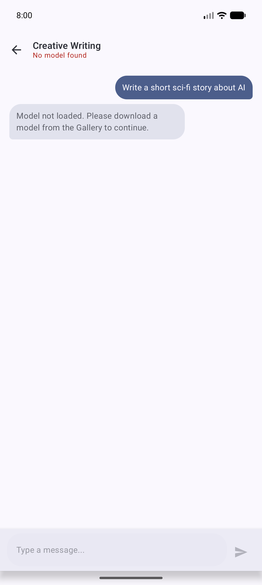
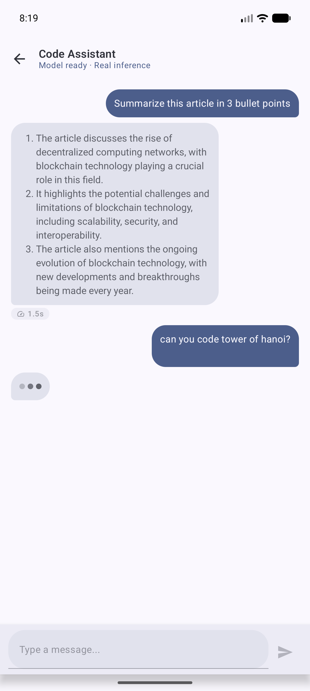
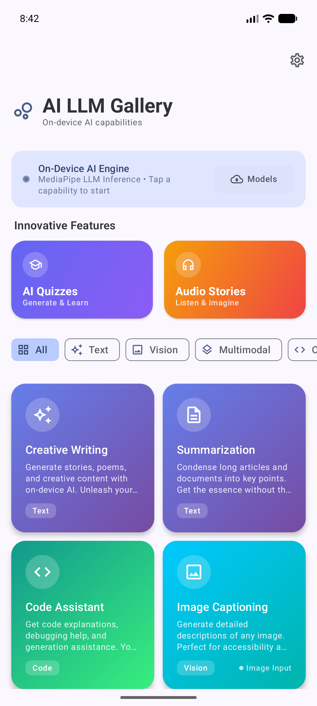
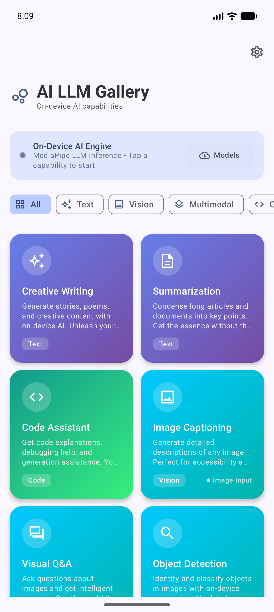

<div align="center">
  
  <h1>🤖 AI LLM Gallery</h1>
  <p><b>A beautifully designed, privacy-first Android application showcasing on-device Large Language Models (LLMs) running entirely locally without internet.</b></p>
  
  <p>
    
    
    
    
    
  </p>
</div>

<br/>

## ✨ Overview

**AI LLM Gallery** brings the power of state-of-the-art Large Language Models directly to your pocket. Built with Google's **MediaPipe LLM Inference Engine**, this app allows you to download, manage, and run optimized AI models (`.task` formats like Gemma and Llama) 100% offline. 

By prioritizing a premium **Material 3 UI**, strict **MVVM architecture**, and zero data telemetry, AI LLM Gallery proves that powerful AI can be local, fast, and gorgeous.

## 🚀 Key Features

*   **⚡ 100% On-Device Inference:** Chat with your models completely offline. No API keys, no server latency, and complete privacy.
*   **🎨 AI Gallery Categories:** Organized prompts for Creative Writing, Summarization, Code Assistance, Image Captioning, and Visual Q&A.
*   **🎓 AI Quizzes (Generate & Learn):** Dynamically generate structured multiple-choice quizzes on any topic using the downloaded model.
*   **🎧 Audio Scripts (Piper TTS):** Generate cinematic stories and instantly listen to them using embedded on-device Text-To-Speech (Kokoro/Piper).
*   **⬇️ In-App Model Hub:** Browse, download, and manage supported 4-bit quantized models directly from HuggingFace via an intuitive Settings dashboard.
*   **💎 Premium Material 3 Design:** Fluid animations, responsive staggered grids, dynamic colors, and edge-to-edge screens.

---

## 🛠️ Tech Stack & Architecture

This codebase is highly modular and strictly follows the modern **MVVM (Model-View-ViewModel)** architectural pattern.

*   **Language:** Kotlin
*   **UI Toolkit:** Jetpack Compose
*   **State Management:** StateFlow & Coroutines
*   **AI Engine:** [MediaPipe Tasks Vision & Text](https://developers.google.com/mediapipe/solutions/text/llm_inference)
*   **Voice Engine:** Piper TTS (Sherpa ONNX)
*   **Local Storage:** Room Database (for saving Quizzes and generated stories)
*   **Networking:** Retrofit & OkHttp (for downloading models)

### Architecture Highlights
*   `ui/` - Contains all composable screens, cleanly isolated from business logic.
*   `ai/` - Core abstraction layer handling model states, inference execution, and TTS.
*   `data/` - Holds local Room DB models and isolated string resources for global localization (SOLID compliance).
*   **ViewModels** bridge the UI and AI engines securely using Kotlin Coroutines `viewModelScope`.

---

## 📱 Screenshots

<div align="center">
  
  
  
  
</div>

---

## ⚙️ Getting Started

### Prerequisites
*   Android Studio Iguana | 2023.2.1 or newer.
*   Android Device with at least **4GB RAM** (8GB+ recommended for 2B parameter models).

### Installation
1. Clone the repository:
   ```bash
   git clone https://github.com/AzharCodeWizard/AILLMGallery.git
   ```
2. Open the project in Android Studio.
3. Sync Gradle and build the project.
4. Run it on an ARM64 physical device (Emulators are heavily bottlenecked for LLM inference).
5. Head to the **Settings** screen inside the app to download your first model!

---

## 🛡️ Privacy First

Because all models are executed strictly on the edge using the device's CPU/GPU/NPU, none of your prompts, messages, or generated responses ever leave your device. 

## 👨‍💻 Developer
Made with ❤️ by **[AzharCodeWizard](https://github.com/AzharCodeWizard)** in India.
